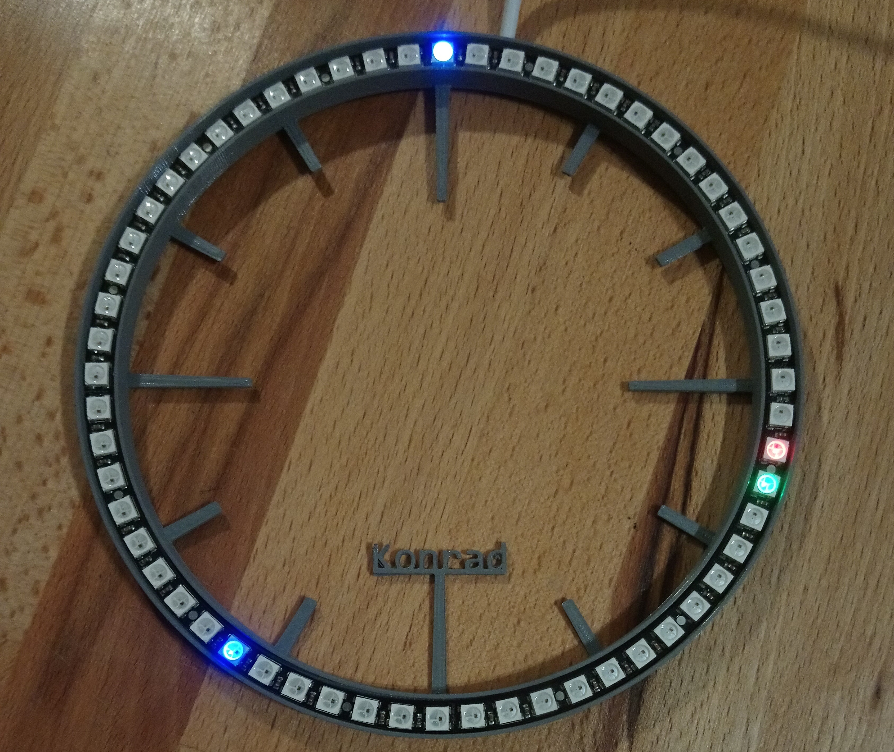

# WS2812B_AVR_CLOCK

#### Hello!
This is simple clock using WS2812B leds, AVR processor and clock crystal.
AVR uC is handling both leds with overclocked internal oscilator and RTC (only time without date) using Timer2 in async mode (AVR134).

Time can be set using UART by sending string in format: ssmmhh\n

Note: WSL - Windows Subsystem for Linux can run windows app, so in Makefile I'm using avrdude.exe to upload code to uC, but compile on linux. 

